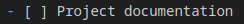

# Rules

Here is a document outlining the fundamental organizational rules of the group.

### Commit convention

For the project, the git Karma convention will be used. (https://karma-runner.github.io/6.4/dev/git-commit-msg.html)

About the convention:

{type} ( {files/branch} ): {Description}

	- type: Based on Git Karma, the type corresponds to the action taken (refer to the Git Karma website for details).

	- files/branch: The files branch corresponds to the file that has been modified or created. If there are too many files, the modified branch will be used.

	- Description: Description corresponds to the details of actions that have been taken.

### Modification of documentation

Given that not all members of the group have Obsidian for editing documentation, some points regarding document modification using VSCode need to be addressed.

##### To do list:

Regarding the to-do list, on VSCode, the fields have this format:

To mark a task as done, you just need to place an 'x' in the field next to the task.

The output will be like so:

##### Other:

As for the rest of the documentation, any questions or significant modifications should be addressed to Morgan.

For minor changes, please refer to the existing documentation or this link: https://www.markdownguide.org/

### Daily meeting

Every morning, meetings will be conducted between 9 AM and 10 AM. 
The purpose of these meetings is to align on the various actions carried out by each member during the day, gain an overview of the overall project progress while focusing on areas requiring assistance or more concentration. 
They also provide an opportunity to discuss all remaining tasks to assess whether certain missions need to be temporarily set aside due to time constraints.

### Branch

For this project, each member works on their own branch. Before each push to the main branch, pull requests should be made so that at least one additional member can review the work done, targeting possible oversight errors.
